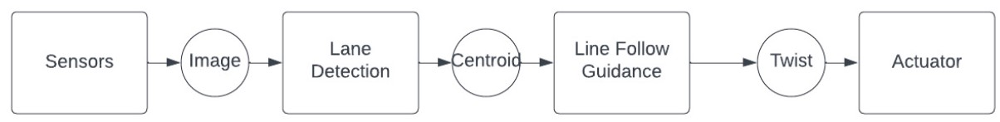
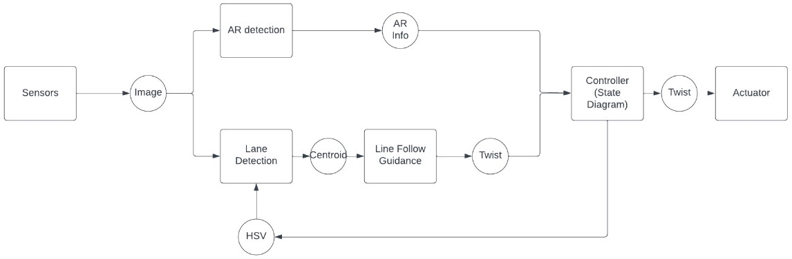
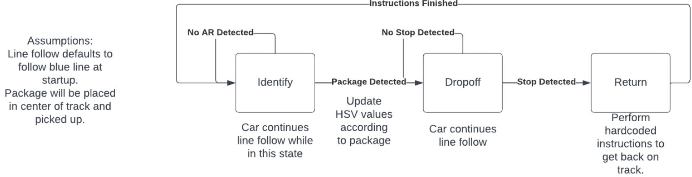
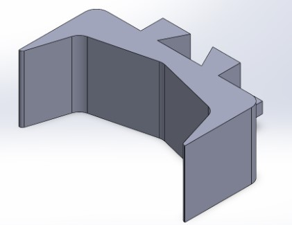
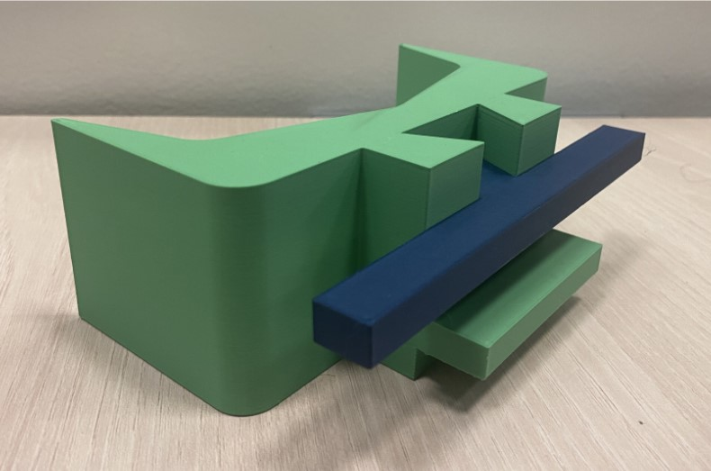
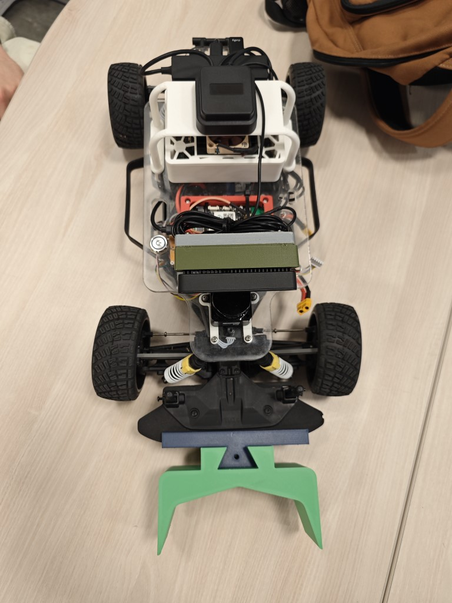
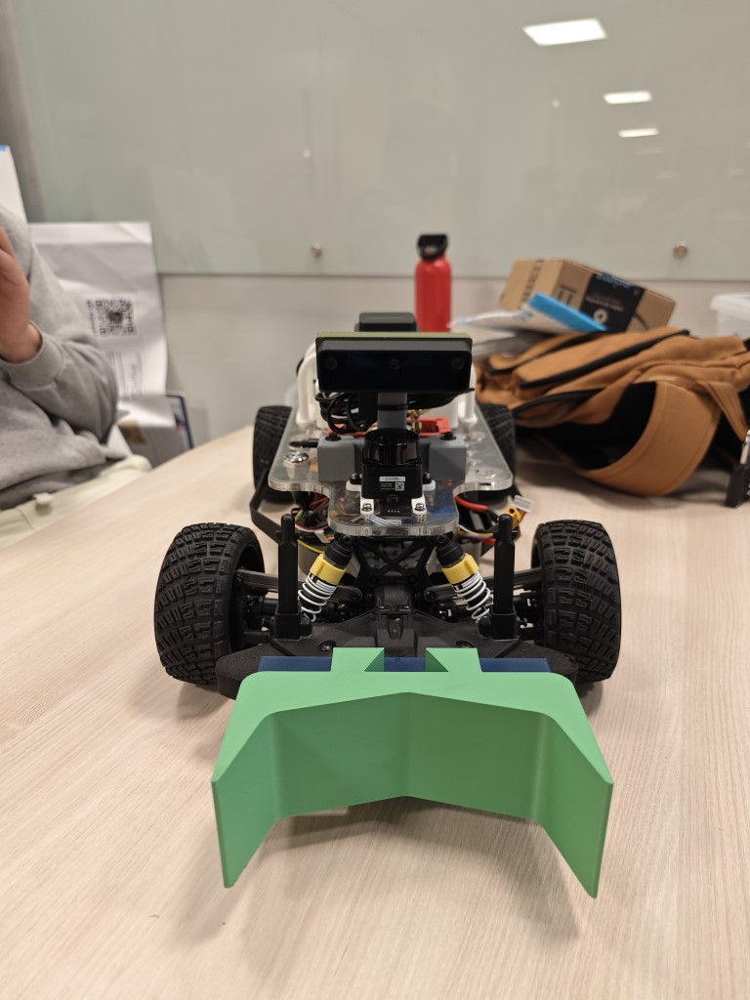
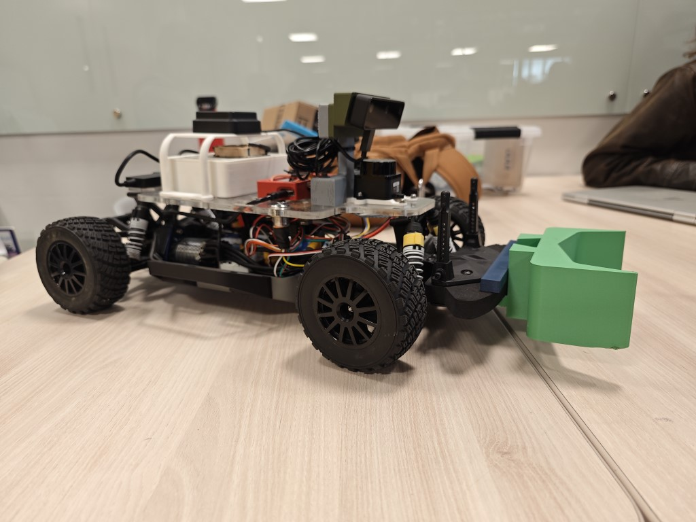

# ECE 148 Winter 2023 Team 12 Final Project

## Team members

- Jake Kindley (ECE)
- Yiteng Zhao (ECE)
- Noah Jones (MAE)

## Overview

We want to create a sorter bot similar to warehouse bots that picks up a package, follow the path with certain color and delivers it to designated dropoff location based on the labels on that package. We plan to put AR tags as labels on the package, and each AR tag is mapped to an id associated with either the color of the lane our bot should follow or stop action when it reaches the designated dropoff zone. At dropoff zone, the bot will perform a series of maneuver and return to the starting point.

## Robot Design & Implementation

### Software

Our code is running on ROS2 and is modified based on the provided lane following code from class. The following flowchart shows the original relationship between each component in the provided lane following code from class:

We added a node responsible for detecting AR tag, read states from AR tag, and changing lane detector's behavior.

In our new node, we have defined two types of AR tags:

- Type 1: Declares the lane color our bot should follow
- Type 2: Stop signal that indicates the bot to drop the package

The default behavior when no AR tag is being detected is following blue lane until a type 1 tag is detected.

### Hardware

We designed a bracket as package holder that snaps on the front bumper of the car and holds one package:

## Showcase

### Assembled Robots

## Final Project Demo

## Remarks

Our video demonstrated our bot's capability of detecting AR tag, selecting the corresponding lane color, following path to dropoff zone, dropping off package in front of stop sign, and return to the starting point. Potential improvements for this project includes adding obstacle avoidance, redesigning the package holder to hold the package above ground, adjusting camera position for better view angle of the lane, and adding capability to navigate through multiple junctions.